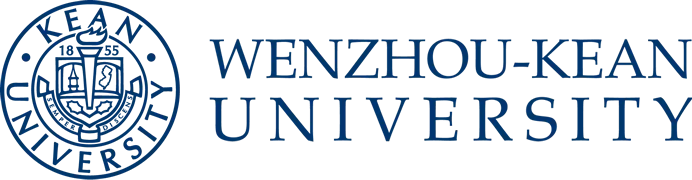

  

<h1 align="center">Hi, I'm Yiling Yang 👋</h1>

  🎓 Student at <b>Wenzhou-Kean University</b> 
  📚 Major in <b>Applied Mathematics</b>

## About Me

I am an Applied Mathematics student at Wenzhou-Kean University with a strong interest in mathematics, data science, biostatistics and machine learning.

I enjoy applying mathematical and computational methods to real-world problems and continuously exploring new topics in data analysis, artificial intelligence, and scientific computing.

### Interests

- Applied Mathematics
- Data Science
- Machine Learning
- Deep Learning
- Scientific Computing
- Mathematical Modeling
